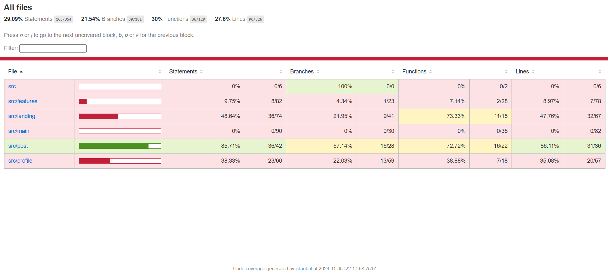

https://hw5-hw88.surge.sh/



```
----------------------|---------|----------|---------|---------|----------------------------------
File                  | % Stmts | % Branch | % Funcs | % Lines | Uncovered Line #s
----------------------|---------|----------|---------|---------|----------------------------------
All files             |   29.09 |    21.54 |      30 |    27.6 |                                  
 src                  |       0 |      100 |       0 |       0 |                                  
  App.js              |       0 |      100 |       0 |       0 | 8                                
  store.js            |       0 |      100 |       0 |       0 | 18-40                            
 src/features         |    9.75 |     4.34 |    7.14 |    8.97 | 
  postSlice.js        |       0 |        0 |       0 |       0 | 5-127
  userSlice.js        |      16 |     7.14 |   11.11 |   15.21 | 15-42,50-112
 src/landing          |   48.64 |    21.95 |   73.33 |   47.76 | 
  LandingPage.js      |   84.61 |    57.14 |   71.42 |   81.81 | 43,47
  LandingPageLogic.js |   40.98 |     14.7 |      75 |   41.07 | 40,46-99
 src/main             |       0 |        0 |       0 |       0 | 
  LeftBar.js          |       0 |        0 |       0 |       0 | 27-308
  MainPage.js         |       0 |        0 |       0 |       0 | 10-47
  RightBar.js         |       0 |        0 |       0 |       0 | 6-82
 src/post             |   85.71 |    57.14 |   72.72 |   86.11 | 
  Post.js             |   92.85 |       50 |   85.71 |    90.9 | 38
  PostList.js         |      60 |    35.71 |   33.33 |   66.66 | 17,98-112
  useFilteredPosts.js |   93.75 |    83.33 |    87.5 |   92.85 | 28
  ProfilePage.js      |   38.33 |    22.03 |   38.88 |   35.08 | 62,85,90-124,129-143,147,209-333
----------------------|---------|----------|---------|---------|----------------------------------

Test Suites: 3 passed, 3 total
Tests:       7 passed, 7 total
Snapshots:   0 total
Time:        7.117 s
Ran all test suites.
```


# timeline

## 11/2

initial project

complete LandingPage.test.js

complete ProfilePage.test.js

## 11/3

 modify bugs in Post.js

 change the structure of project

 ## 11/4

 add post.title filter in useFilteredPosts.js

 complete Post.test.js

 rename some \*.test.js

 change the structure of Post.js

 complete LandingPage.test.js

 function:  add follow and unfollow with posts changing

 function: persistant userStatus

 function: comments